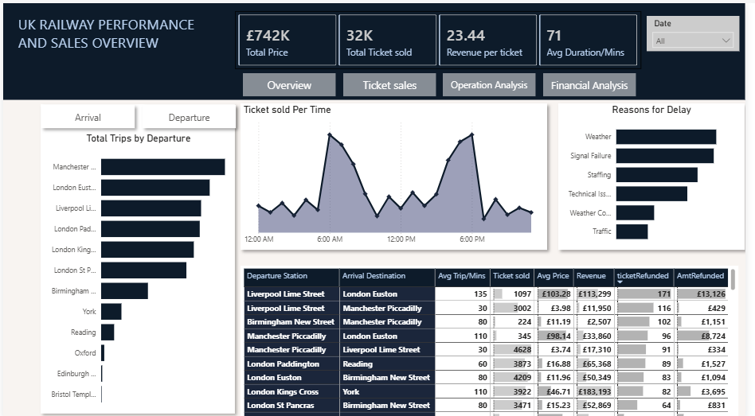

# UK Railway Performance and Ticket Sales Analysis

## Project Overview

I assumed the role of an Operation Analyst with Maven Analytics and analysed the UK Train Rides between the Period of Janauary to April 2024.
This project focuses on Train ticket sales and operational performance data to uncover trends in passenger demand, route performance, revenue generation, 
and service disruptions. The dashboard was developed in Power BI to provide stakeholders with a comprehensive view of railway operations and customer purchasing behavior.
The analysis focuses on ticket sales performance, revenue trends, station activity, passenger travel patterns, and the operational factors affecting railway services.

## Executive Summary

The railway network generated approximately £742,000 in revenue from the sale of over 32,000 tickets, with an average revenue of £23.44 per ticket. 
The average journey duration across all routes was 71 minutes.
The analysis reveals that major city routes such as Liverpool Lime Street, London Euston, Manchester Piccadilly, and London Paddington dominate passenger traffic, 
highlighting the importance of intercity travel within the UK rail network.
Ticket demand is concentrated during peak commuting hours, particularly in the early morning and late afternoon periods, reflecting typical work-related travel behavior.
Operationally, weather conditions and signal failures emerged as the leading causes of service delays, indicating areas where service reliability improvements could significantly 
enhance customer experience.

## Key Findings

**1. Revenue and Sales Performance :**
Total revenue generated reached £742K.
More than 32,000 tickets were sold across the network.
Average revenue per ticket stood at £23.44.
High-volume routes contributed significantly to overall revenue performance.
Premium-priced routes generated substantial revenue despite lower ticket volumes compared to commuter routes.

**2. Passenger Travel Patterns :**
Ticket purchases show clear peak periods:
Early morning (around 6 AM – 8 AM)
Late afternoon to evening (around 4 PM – 7 PM)
These patterns suggest strong commuter demand and business travel activity.
Midday travel volumes were comparatively lower, indicating reduced demand outside peak hours.

**3. Most Active Departure Stations :**
The busiest departure stations include:
Manchester Piccadilly
London Euston
Liverpool Lime Street
London Paddington
London Kings Cross
London St Pancras

These stations act as major transportation hubs and account for a significant share of total trips across the network.

**4. Top Performing Routes :**
Several routes consistently generated high ticket volumes and revenue:
Liverpool Lime Street → London Euston
Liverpool Lime Street → Manchester Piccadilly
Birmingham New Street → Manchester Piccadilly
Manchester Piccadilly → London Euston
London Euston → Birmingham New Street

The Liverpool–London corridor appears particularly strong, contributing both high passenger numbers and substantial revenue.

**5. Operational Performance and Delays :**
Analysis of delay causes revealed that the primary operational challenges were:

Weather-related disruptions
Signal failures
Staffing shortages
Technical issues
Traffic congestion

Weather and signal failures accounted for the highest proportion of delays, indicating that infrastructure resilience and maintenance improvements could have a meaningful impact on service reliability.

**6. Customer Refund Activity :**
Refund data indicates that service disruptions directly influence revenue retention.

## Key observations:

Routes with higher delay frequencies experienced increased refund volumes.
Certain high-traffic routes generated both the highest revenue and the highest refund values.
Improving operational reliability presents an opportunity to reduce refund costs and improve profitability.

Business Insights
Demand Management

The concentration of ticket sales during peak hours presents opportunities for:

Dynamic pricing strategies
Capacity planning
Resource allocation optimization
Revenue Growth Opportunities

High-performing intercity routes demonstrate strong customer demand and could benefit from:

Increased service frequency
Premium service offerings
Targeted promotional campaigns
Operational Improvement Areas

Since weather and signal failures represent the leading causes of delays, railway operators should consider:

Infrastructure modernization
Predictive maintenance programs
Enhanced weather-response planning
Customer Experience

Reducing service disruptions can:

Lower refund costs
Improve passenger satisfaction
Increase customer retention and loyalty
Tools & Technologies Used
Power BI – Dashboard Development and Data Visualization
Power Query – Data Cleaning and Transformation
DAX – KPI Calculations and Business Metrics
Data Modelling – Fact and Dimension Relationships
Data Analysis – Revenue, Sales, and Operational Performance Analysis
Conclusion

The analysis demonstrates that the UK railway network is heavily driven by commuter and intercity travel, with major stations and routes accounting for the majority of passenger 
demand and revenue generation. While revenue performance remains strong, operational challenges—particularly weather-related disruptions and signal failures—continue to impact 
service reliability and customer satisfaction.

By leveraging data-driven insights for capacity planning, infrastructure improvements, and customer experience initiatives, railway operators can improve operational efficiency, 
increase profitability, and deliver a more reliable travel experience
